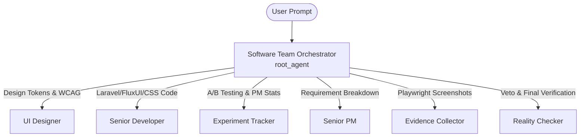

# Product Requirement Document (PRD)

## Project Name: Gemini Enterprise Agentic Delivery (GEAD)
**Document Status**: Draft  
**Target Launch**: Q3 2026  
**Document Version**: 1.0  
**Author**: Deepak Yadav & Antigravity AI  

---

## 1. Executive Summary

### 1.1 Product Overview
**Gemini Enterprise Agentic Delivery (GEAD)** is a next-generation, multi-agent orchestration framework designed to automate the entire software development lifecycle (SDLC) from specification to production readiness. Built upon the **Google Agent Development Kit (ADK)** and powered by **Gemini Enterprise (Vertex AI Agent Engine)**, GEAD implements a hierarchical orchestrator-subagent team structure. 

Instead of relying on monolithic system prompts, GEAD models a real-world agile engineering team. A top-level coordinator delegates specialized developer, design, project management, and quality assurance tasks to 6 distinct agent personas, resulting in structured, deterministic, and visually-certified code delivery.

### 1.2 Problem Statement
Modern software engineering teams face significant overhead in translating product specifications into technical tasks, designing accessible user interfaces, coding interactive layouts, and executing comprehensive cross-device visual testing. Existing LLM code assistants generate single-file code blocks without holistic coordination, QA validation, or statistical tracking of user feedback.

### 1.3 Vision & Solution
GEAD solves this by introducing a complete **virtual software team**. Users input raw technical specifications, and the orchestrator dynamically coordinates a multi-agent assembly line. Critically, GEAD bridges the gap between text generation and reality by integrating an automated **Playwright capture engine**, allowing QA agents to visually review and certify rendered outputs before final production deployment.

---

## 2. Product Goals & Objectives

### 2.1 Core Objectives
*   **Automate Spec-to-Code Pipelines**: Reduce the time required to convert raw technical specs into verified, styled web layouts by 80%.
*   **Ensure Visual Fidelity**: Use automated screenshot tools to evaluate front-end rendering across multiple viewport dimensions (Desktop, Tablet, Mobile) and themes.
*   **Uphold Compliance Standards**: Guarantee that all generated interfaces comply with web design guidelines and accessibility targets (WCAG 2.1 AA).
*   **Establish Production-Ready Telemetry**: Export trace paths and user feedback loops directly to enterprise dashboards (Google Cloud Logging & Trace).

### 2.2 Success Metrics (KPIs)
*   **Orchestration Accuracy**: >95% delegation accuracy (orchestrator selecting the correct subagent for a given query).
*   **Zero-Draft Defect Rate**: Average of 3-5 visual defect detections per first-draft build, ensuring strict QA vetting.
*   **Build Delivery Speed**: End-to-end spec parsing to code rendering under 120 seconds.
*   **System Completeness Grade**: >85% final assessment score from the Reality Checker agent based on cross-device screenshot analysis.

---

## 3. User Personas & Use Cases

### 3.1 Targeted Personas
1.  **Product Managers (PMs)**: Need to turn raw feature ideas into highly-detailed, technical tasks and verify visual outputs without writing code.
2.  **Full-Stack Developers**: Need boilerplate configurations, accessible design system tokens, and refined micro-interactions.
3.  **QA Engineers**: Need automated, repeatable visual regression checks across Desktop, Tablet, Mobile, and Dark Mode.
4.  **DevOps & Platform Engineers**: Need to deploy stable agents to Google Cloud Agent Runtime with robust monitoring.

### 3.2 Core Use Cases
*   **Rapid Spec Vetting**: A PM inputs a landing page idea. The `senior_pm` agent breaks it down into structured developer tasks, and the `ui_designer` suggests WCAG-compliant colors.
*   **Component Development**: A developer requests a complex UI component. The `senior_developer` produces styled HTML/CSS, implementing light/dark toggle options and fluid animations.
*   **Automated Visual Certification**: The `evidence_collector` runs local Playwright tests on the built page, and the `reality_checker` validates the final screenshots, certifying the release only when all visual assets are present.

---

## 4. Functional Requirements & System Prompts

GEAD uses a **Hierarchical Orchestrator Pattern** to split complex user commands among specialized subagents.



### 4.1 Agent Roles & Core Prompts

#### 1. Software Team Orchestrator (`root_agent`)
*   **Role**: Top-level dispatcher and coordinator. Analyzes incoming queries and delegates tasks sequentially or parallelly across the team.
*   **Prompt Mandate**: Coordinate the 6 specialists, sequence multi-agent tasks, and present compiled, professional updates back to the user.

#### 2. UI Designer (`ui_designer`)
*   **Role**: Visual design system and UX specialist.
*   **Prompt Mandate**: Establish spacing scales, accessible HSL typography tokens (WCAG AA), consistent components, and performance-conscious layout designs.

#### 3. Senior Developer (`senior_developer`)
*   **Role**: Full-stack coder specializing in Laravel, Livewire, FluxUI, advanced CSS, and fluid interactive animations (3D, glassmorphism).
*   **Prompt Mandate**: Implement system/light/dark theme toggles on every site, structure clean front-end components, and optimize performance for 60fps animations.

#### 4. Experiment Tracker (`experiment_tracker`)
*   **Role**: PM specializing in statistical hypothesis testing and A/B test parameters.
*   **Prompt Mandate**: Define sample size calculations, establish 95% statistical confidence tests, monitor soft rollouts, and document rollback protocols.

#### 5. Senior PM (`senior_pm`)
*   **Role**: Scope controller and functional analyst.
*   **Prompt Mandate**: Convert product specifications into development-ready, actionable tasks. Stop scope creep and verify acceptance criteria without adding "luxury" features unless explicitly asked.

#### 6. Evidence Collector (`evidence_collector`)
*   **Role**: Visual-focused, screenshot-capturing QA specialist.
*   **Prompt Mandate**: Execute local Playwright scripts (`run_playwright_capture`) to capture UI rendering. Identify 3-5 visual defects per initial build (accordions, mobile menus, layout shifts) and require physical visual proof.

#### 7. Reality Checker (`reality_checker`)
*   **Role**: Senior integration and certification specialist.
*   **Prompt Mandate**: Mitigate "fantasy approvals." Review Playwright captures, cross-reference with QA findings, grade output objectively, and issue final certification of production readiness.

---

## 5. Non-Functional & Technical Requirements

### 5.1 Technology Stack
*   **Core Logic**: Python (>=3.11, <3.14) managed via **`uv`**.
*   **LLM Model**: Vertex AI Gemini API utilizing `gemini-flash-latest`.
*   **Agent Development**: Google ADK (Agent Development Kit).
*   **Automated QA**: Playwright script capture wrapper (`qa-playwright-capture.sh`).
*   **Infrastructure**: Terraform configurations for single-project and shared resources on Google Cloud Platform.

### 5.2 Observability & Telemetry
*   **Instrumentation**: Built-in **OpenTelemetry (OTel)** hooks to capture trace timelines of agent execution and tool invocations.
*   **Logging**: Export telemetry to Google Cloud Logging under the `gemini-enterprise-agentic-delivery` service namespace.
*   **User Feedback Collection**: Endpoints tracking user satisfaction metrics (numeric scores and structured feedback strings) exported via standard schemas:
    ```json
    {
      "score": 5,
      "text": "Great response!",
      "user_id": "test-user",
      "session_id": "test-session"
    }
    ```

---

## 6. Implementation & Deployment Phase Gate

To ensure enterprise-grade stability, GEAD development must pass through 6 strict execution phase gates:

```
+------------------------+      +------------------------+      +------------------------+
| Phase 1: Understand    | ---> | Phase 2: Build & Code  | ---> | Phase 3: Evaluation    |
| Analyze specifications |      | Implement ADK agents   |      | Run evaluation sets    |
+------------------------+      +------------------------+      +------------------------+
                                                                             |
+------------------------+      +------------------------+                   v
| Phase 6: Production    | <--- | Phase 5: Dev Deploy    | <--- | Phase 4: Pre-Deploy    |
| Establish CI/CD pipeline|      | Deploy to dev runtime  |      | Run unit & integration |
+------------------------+      +------------------------+      +------------------------+
```

1.  **Phase 1: Understand Requirements**: Deconstruct specs and establish goals before writing code.
2.  **Phase 2: Build and Implement**: Author agent definitions in `app/agent.py` and tools in `app/tools.py`.
3.  **Phase 3: The Evaluation Loop**: Execute offline agent validation against structured test suites (`basic.evalset.json`) using `agents-cli eval run`.
4.  **Phase 4: Pre-Deployment Tests**: Run comprehensive Python tests (`pytest tests/unit tests/integration`).
5.  **Phase 5: Deploy to Dev (Requires Human Approval)**: Package and deploy the agent engine to Google Cloud Agent Runtime via `agents-cli deploy`.
6.  **Phase 6: Production Deployment**: Build and scale using automated CI/CD and infrastructure-as-code pipelines (`agents-cli infra cicd`).
